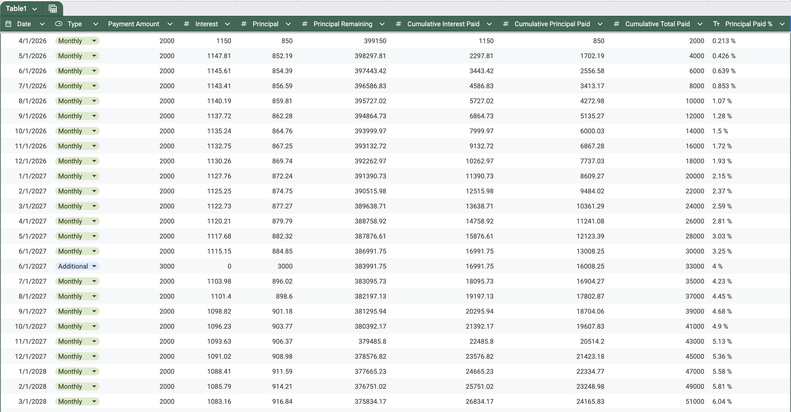
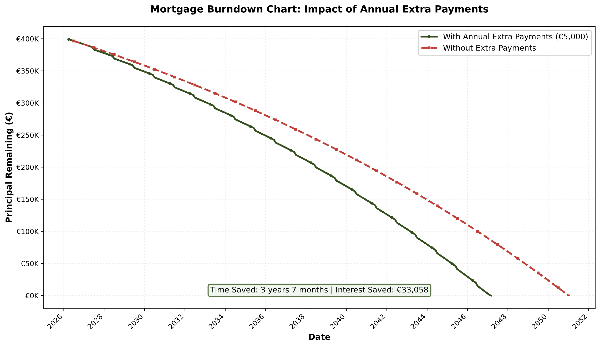
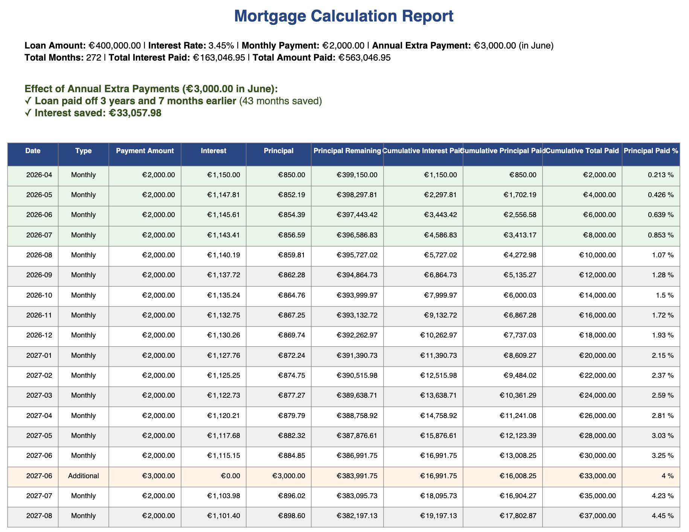

# Mortgage Payoff Analyzer

A comprehensive mortgage amortization calculator that simulates loan repayment scenarios with support for annual extra payments. This tool helps you visualize how additional payments can accelerate your mortgage payoff and calculate the interest savings.

## Features

✨ **Comprehensive Analysis**

- Calculate full amortization schedule with monthly breakdown
- Simulate impact of annual extra payments on loan payoff timeline
- Compare two scenarios: with and without extra payments
- Generate detailed reports showing interest and principal breakdown

📊 **Multiple Output Formats**

- **CSV Export**: Full amortization table for spreadsheet analysis
- **PDF Report**: Formatted calculation report with summary statistics
- **Burndown Chart**: Visual comparison of payoff timelines

🔧 **Flexible Configuration**

- Customize loan amount, interest rate, and monthly payment
- Set annual extra payment amount and month
- Control how many years to apply extra payments

## Setup

### Prerequisites

- Python 3.7+
- pip

### Installation

1. **Clone or download this project**
2. **Install dependencies**
   ```bash
   pip install -r requirements.txt
   ```
3. **Create initial data file**

   ```bash
   cp data.example.csv data.csv
   ```

   Input your existing payment data in `data.csv`

## Usage

### Step 1: Configure Your Mortgage

Edit the first cell in `main.ipynb` with your mortgage details:

```python
LOAN_AMOUNT = 400_000              # Your total loan amount in EUR
INTEREST_RATE = 3.45               # Annual interest rate as percentage
MONTHLY_PAYMENT = 2_000.00         # Your monthly payment amount

ANNUAL_EXTRA_PAYMENT = 2_000       # Annual extra payment amount
ANNUAL_EXTRA_PAYMENT_MONTH = 6     # Month to make extra payment (1-12, e.g., 6=June)
ANNUAL_EXTRA_PAYMENT_COUNT = -1    # -1 = apply until loan is paid off, or specify number
```

### Step 2: Run the Calculator

Open `main.ipynb` in Jupyter and run all cells. The script will:

1. Read existing payment data from `data.csv`
2. Calculate remaining payments until loan payoff
3. Generate three output files in the `results/` directory

### Step 3: Review Results

Check the `results/` directory for:

- `calculation.csv` - Complete amortization schedule
- `calculation.pdf` - Formatted report with summary
- `burndown.pdf` - Visual comparison chart

## Input Data

The calculator uses `data.csv` as input, which contains historical payment records with columns:

- Date (YYYY-MM format)
- Type (Monthly, Additional)
- Payment Amount
- Interest
- Principal
- Principal Remaining
- Cumulative values (Interest Paid, Principal Paid, Total Paid)
- Principal Paid %

**Template**: Use `data.example.csv` as a template when starting a new analysis.

## Output Examples

### Calculation Report



### Burndown Chart



### Amortization Schedule



## How It Works

1. **Load Historical Data**: Reads `data.csv` to get starting point for calculations
2. **Calculate Monthly Payments**: Uses loan details to compute interest/principal split for each month
3. **Apply Extra Payments**: Adds annual extra payments in specified month, reducing term and interest
4. **Generate Outputs**:
   - CSV for detailed analysis
   - PDF reports with formatted tables and summaries
   - Burndown chart comparing scenarios

## Example Scenario

With a €400,000 mortgage at 3.45% interest:

- Monthly payment: €2,000.000
- Annual extra payment: €3,000 (June)
- Result: Loan paid off **3 years and 7 months earlier (43 months saved)** with **€33,057.98 in interest saved**

_(Run the calculator to see your specific savings)_

## Notes

- The calculator rounds values to 2 decimal places for currency accuracy
- Principal Remaining percentage shows cumulative progress toward full payoff
- The `data.csv` file should be updated as you make actual payments
- Annual extra payments are only applied if loan balance remains after regular payment

## License

This project is free to use and modify.

## Support

Feel free to create issues or PRs 👋🏻
